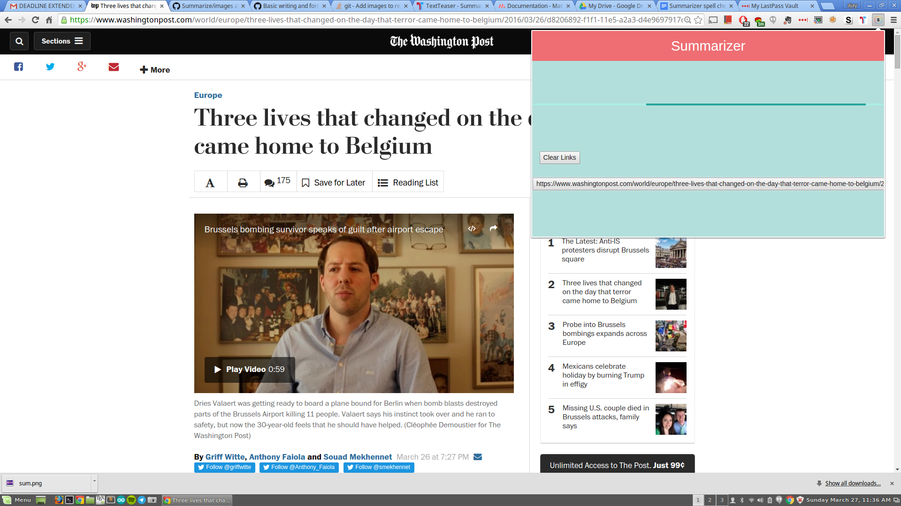
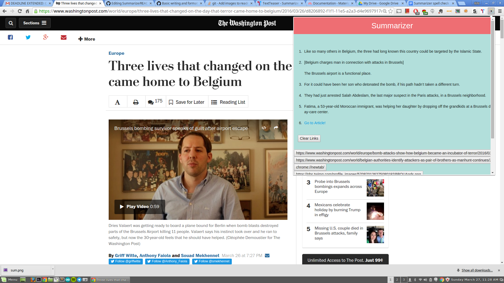

# Summarizer

## What it Does
Summarizer is an application that will take the current news article that you are currently looking at and after clicking the chrome extension, will summarize the article into 5 concise sentences. It also stores the previous analyzed articles and can access them by merely clicking on the button below. 

##How I made it
I first started with the google template for chrome extensions. This was my first time writing javascript and my first time building a chrome extension so using the google documentation helped a lot!

###Libraries and API's
For libraries and api's i used the textTeaser api. [TextTeaser](http://textteaser.com/) is a natural language processing api that can summarize web pages so I acessed the api and used it for the meat of my application. I also used [Materialize.css](http://materializecss.com/) as the css framework for my project as I needed a quick and easy way to style it and Mateiralize fit that description perfectly.

##Screenshots of the app

##Problems, Pitfalls, and Progress
Most of my problems revolved around accessing the api and using that data correctly. After i had figured out how to actually call the api I was not able to correctly display the data. After a lot of debugging I had finally figured out that it was due to the asynchronous nature of javascript. This being my first language that I have worked with that was asynchronous, I was confused but also intrigued. I learned more about the best practices for how to work with asynchronous languages and managed to finally figure it out!

##Current Known Bugs
As of right now the New York Times does not display on my application. The reason for that is the Times masks their articles behind their website so that it cannot be scraped for applications like mine. Under current time constraints I was not able to implement use of the New York Times. The way to do it would be through their api and various calls to get the text.

##Planned Changes
I would like to implement the New York Times to work. I also would like to make it so that if a previous link button was clicked, then the extension would then transition to a tile based page and you would be able to click a previous article you already analyzed.

##How to run the app
Drag and Drop the CRX file into the the chrome://extensions page and hit install. Then navigate to any article(a good website is the washington post) and click the extension!

